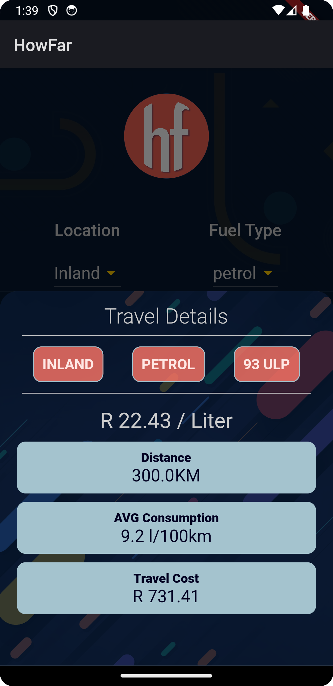
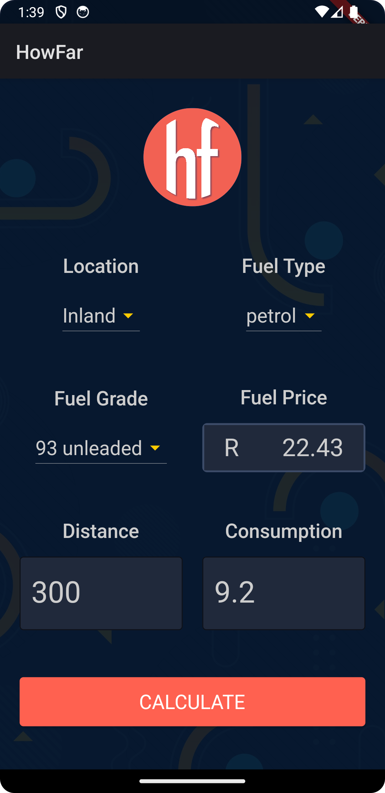

# HowFar

Cross Platform utility app:

The App automatically gets the current fuel price for both Petrol and Diesel
The App works out the Rand value of fuel required based on the entered travel distance.

Credit
- Image by <a href="https://www.freepik.com/free-vector/flat-geometric-background_14456019.htm#page=2&query=shapes%20background&position=35&from_view=keyword&track=ais">Freepik</a>
- Image  <a href="http://www.freepik.com">Designed by Ydlabs / Freepik</a>

